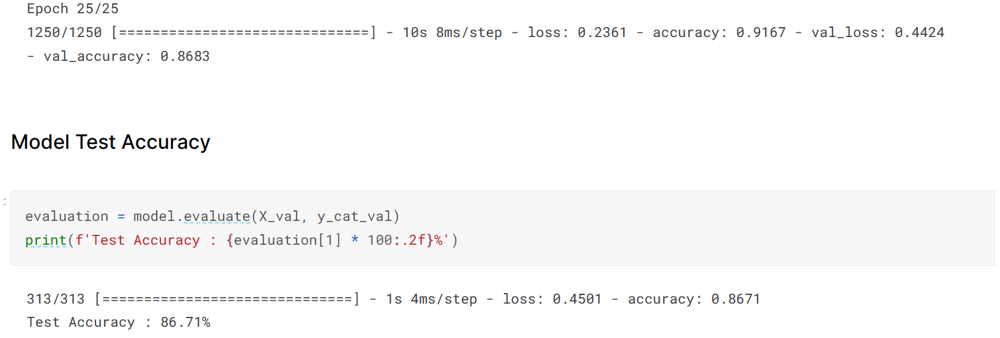

## CIFAR10_with_Keras
Implementation of basic CNN on the CIFAR-10 image classification dataset

I have created a basic Convolutional Neural Net using Keras involving:
  1. Dropout Regularization
  2. BatchNormalization
  3. ReduceLROnPlateau Callback
  4. Adam optimizer with Nesterov momentum

This model achieved a training accuracy of 91.67% and test accuracy of 86.71%.

This is the link to my Kaggle notebook for the same:  https://www.kaggle.com/code/gautamrmenon/cifar-10-using-keras
